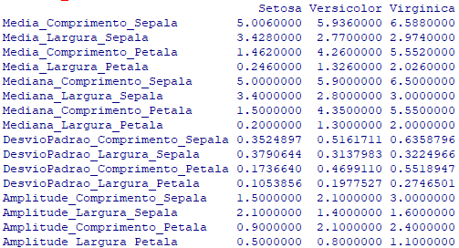
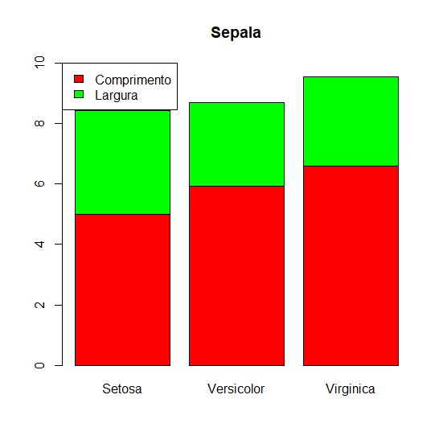
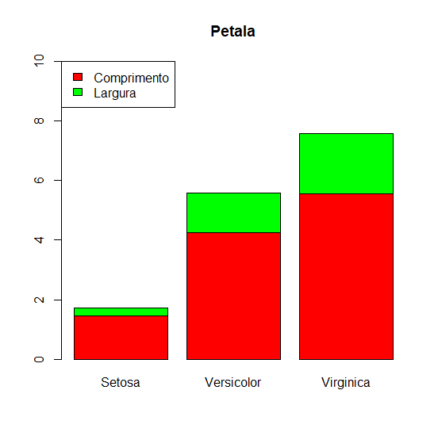

# Probabilidade-e-Estatistica Atividade 4

<h3>A)</h3> Para comparações de tamanho entende-se a área que as petalas ou sepalas ocupam.

Em média as virginicas são maiores tanto em sepalas quanto em petalas.

As sepalas setosas e versicolors tem tamanho semelhante mas a tanto a media quanto
a mediana mostram que as sepalas versicolors e virgnicas são mais ovaladas do 
que as setosas pois a proporção da largura para o comprimento delas é menor, neste sentido 
virginicas e versicolors tendem a se assemelhar.

Os tamanhos das petalas das 3 tendem a seguir esta ordem: Virginica > Versicolor >
Setosa.

As petalas das Setosas tendem a ser as mais ovaladas entre as 3 enquanto as outras
duas tendem a se assemelhar.

O desvio padrão das 3 espécies é baixa, estando todas em torno de 20% da amplitude das
medições (desvio padrão / amplitude).

<h3>B)</h3>

 <ul>
     <li>
        
         
    </li>
</ul>

Estes graficos mostram a proporcionalidade entre tamanho e largura das sepalas e petalas das flores, ao ver esse grafico a conclusão é que a interpretação dos dados na questão A tende a estar correta.
