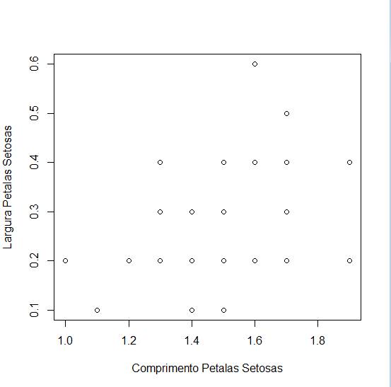
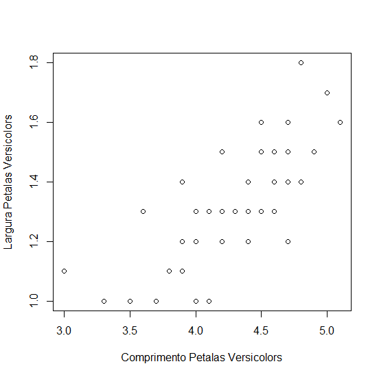
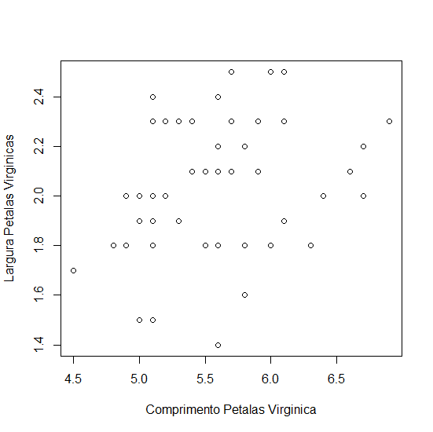
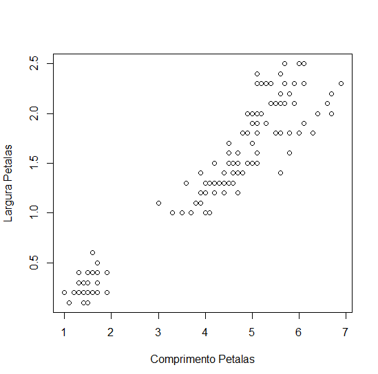

# Probabilidade-e-Estatistica Atividade 4

<h3>A)</h3> Para comparações de tamanho entende-se a área que as petalas ou sepalas ocupam.

Em média as virginicas são maiores tanto em sépalas quanto em pétalas.

As sépalas setosas e versicolors tem tamanho semelhante mas a tanto a media quanto
a mediana mostram que as sépalas versicolors e virgnicas são mais ovaladas do
que as setosas pois a proporção da largura para o comprimento delas é menor, neste sentido
virginicas e versicolors tendem a se assemelhar.

Os tamanhos das pétalas das 3 tendem a seguir esta ordem: Virginica > Versicolor >
Setosa.

As pétalas das Setosas tendem a ser as mais ovaladas entre as 3 enquanto as outras
duas tendem a se assemelhar.

O desvio padrão das 3 espécies é baixa, estando todas em torno de 20% da amplitude das
medições (desvio padrão / amplitude).

<h3>B)</h3>

Estes gráficos mostram a proporcionalidade entre tamanho e largura das sépalas e pétalas das flores, ao ver esse gráfico a conclusão é que a interpretação dos dados na questão A tende a estar correta.

<h3>C)</h3>

Acredito que sim mesmo essa associação sendo bem mais perceptível Versicolors, tanto nas Setosas quanto nas Virgnicas essa
correlação parece ser baixa mas ainda sim perceptível, isso é perceptível ao observar os gráficos.

Correlação de Pearson Setosas:		0.33163		código r: cor(iris[1:50,3],iris[1:50,4])

Correlação de Pearson Versicolors:	0.7866681	código r: cor(iris[51:100, 3],iris[51:100, 4])

Correlação de Pearson Virginicas: 	0.3221082	código r: cor(iris[101:150, 3],iris[101:150, 4])

Quando é calculada a correlação de Pearson para todas as amostras de todas as 3 espécies a correlação se torna mais clara.
Correlação de Pearson todas amostras:	0.9628654	código r: cor(iris[,3],iris[,4])
